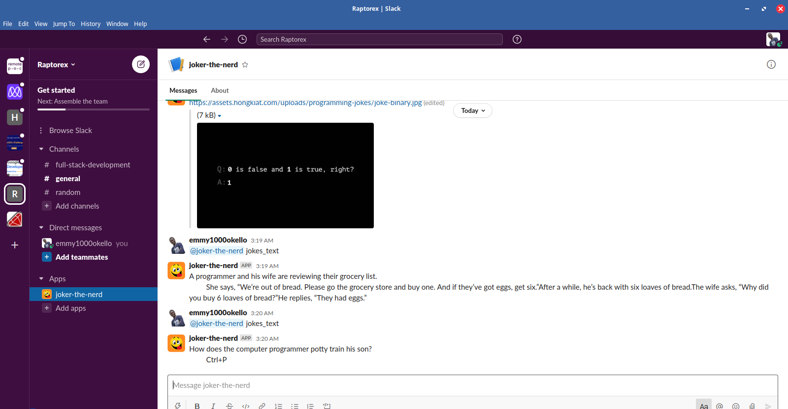

# Capstone Project: Ruby: Slack Bot
> nerd-bot is a bot built with the goal to automate jokes and humor mainly popular within the developers community. Most times
we developers/programmers get tired writing code and since https://www.slack.com is where most of our interaction occurs, it's not uncommon to just chat with a bot cracking jokes as your teammates might still be busy, nice right?
Nerd-bot scraps the web and returns you random jokes in form of images or text given the right commands in slack.

## Screenshot

## Built With
- [Ruby](https://www.ruby-lang.org/en/)
- [Gems](https://rubygems.org/)
  - [slack-ruby-bot](https://github.com/slack-ruby/slack-ruby-bot)
  - [Nokogiri](https://nokogiri.org/)
  - [HTTParty](https://github.com/jnunemaker/httparty)
  - [Rspec](https://rspec.info/)
  - Plus other dependencies, checkout the `Gemfile`

## Getting Started
  ### Slack Workspace
  - You will need to create a new slackwork space 
  - Head over to http://slack.com/services/new/bot
  - Give your bot a name
  - Configure it as you desire and save integration
  - Save the SLACK_API_TOKEN string that starts with `xoxb`, you will need it later
  - Head over to slack and you will see your bot
  ### Ruby Project
  - Clone this project locally
  - Run `git checkout feat/slack-bot` in the terminal
  - Run `bundle` to install `Gems` and their dependencies.
  - Create a `.env` file and paste your earlier saved SLACK_API_KEY
  - Check the `.env.example` file on how to do it
  - Run `bundle exec rackup` to start it the server
  - Your bot should be working by now

  ### Running Test
  - Test have been built using `Rspec` as Test Runner and Fixture
  - Test Coverage by `SimpleCov`
  - Run `rspec` to run the test
  - On windows run `open coverage/index.html` for code coverage
  - On unix based systems run `xdg-open coverage/index.html` for code coverage

  ### Testing on Slack
  - The bot can be invited into other workspace or direct messaged
  - Use `@bot_username jokes_image` to get programming jokes as images where `@bot_username` is the name of your bot
  - Use `@bot_username jokes_text` to get programming jokes as texts
  - Use `@bot_username say_hello` to greet the bot
  - The `@bot_username` is optional while talking in a Direct message with the bot
  - Type `@bot_username` `help` for the above commands
  - Enjoy

## Author

👤 **Emmanuel Okello**

- GitHub: [@oxenprogrammer](https://github.com/oxenprogrammer)
- Twitter: [@ox_emmy](https://twitter.com/ox_emmy)
- LinkedIn: [LinkedIn](https://www.linkedin.com/in/emanuel-okello-1217b4b3/)

## 🤝 Contributing

Contributions, issues, and feature requests are welcome!

## Acknowledgments

-  

-  https://github.com/slack-ruby/slack-ruby-bot

## Show your support

Give a ⭐️ if you like this project!

## 📝 License

This project is [MIT](https://opensource.org/licenses/MIT) licensed.